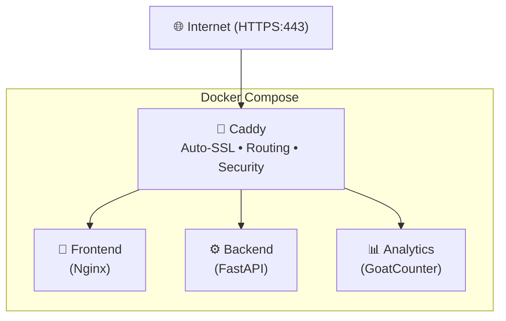

# Personal CV Website - robin-nogues.com

This repository contains the source code for my personal CV and portfolio website, live at [robin-nogues.com](https://robin-nogues.com/).

It is designed to showcase my skills, experience, and projects in a clean, modern, and responsive interface. The project is built with a microservice architecture, separating the frontend and backend concerns.

## ✨ Features

-   **Fully Responsive:** Optimized for desktops, tablets, and mobile devices.
-   **Comprehensive Sections:** Includes Professional Experience, Personal Projects, Skills, Education, and Certifications.
-   **Interactive UI:** Dark mode, smooth animations, active navigation link highlighting, animated burger menu and a "Back to Top" button.
-   **Combats Spam:** A secure contact form with backend processing, input validation, and anti-spam (honeypot, API Rate Limiting) protection.
-   **Privacy-Focused Analytics:** Self-hosted analytics with GoatCounter, providing traffic statistics without tracking cookies or sharing data with third parties (GDPR compliant).
-   **Automated Deployment:** CI/CD pipeline for automated builds and deployments to a live server.

## 🏗️ Architecture & Tech Stack

The project follows a microservice architecture, containerized and orchestrated with Docker and Docker Compose.



### Services

| Service | Technology | Purpose |
|---------|------------|---------|
| **Frontend** | HTML, CSS, JavaScript, [Nginx](https://nginx.org/) | Static website content |
| **Backend** | Python, [FastAPI](https://fastapi.tiangolo.com/) | Contact form handling, validation, email sending |
| **Reverse Proxy** | [Caddy](https://caddyserver.com/) | Automatic SSL, routing, security headers, rate limiting |
| **Analytics** | [GoatCounter](https://www.goatcounter.com/) | Privacy-focused, cookie-free traffic analytics |

### Infrastructure & DevOps

- **Containerization:** Docker & Docker Compose
- **CI/CD:** GitHub Actions (auto-deploy on push to `main`)
- **Hosting:** Virtual Private Server (VPS)

## 🚀 Getting Started

To run this project locally, you need Docker and Docker Compose installed.

### 1. Clone the Repository

```bash
git clone https://github.com/RobinNogues/my-cv.git
cd my-cv
```

### 2. Configure Environment

The project uses a centralized `.env` file at the root for all services.

Copy the environment template and fill in your credentials:

```bash
cp .env.template .env
```

Now, edit the `.env` file with your details:

```env
DOMAIN=localhost
EMAIL=your@email.com
EMAIL_PASS=your_app_password
SMTP_SERVER=smtp.gmail.com
SMTP_PORT=465
```

> [!CAUTION]
> **Never use your real email password!** Create a dedicated App Password for this application. This is a unique password generated specifically for third-party apps, which you can revoke at any time without affecting your main account.

For local development, you can set `DOMAIN=localhost`. In production, set it to your actual domain (e.g., `robin-nogues.com`).

### 3. Configure Analytics (First Time Only)

After building and running the services, you need to create the GoatCounter site:

```bash
docker exec -it cv_goatcounter goatcounter db create site \
  -vhost=stats.localhost \
  -user.email=your@email.com \
  -password=yourpassword
```

This creates the analytics site with your login credentials.

### 4. Build and Run

From the **root directory** of the project (`my-cv/`), run the following command to build the images and start the services:

```bash
docker-compose up --build -d
```

The docker-compose.override.yml needs to be used for the local installation.

### 5. Access the Website

The website should now be running and accessible at https://localhost. Caddy will serve the frontend and proxy API requests to the backend.

-   **Website:** https://localhost
-   **Analytics:** https://stats.localhost (login with email/password from step 3)

The front will also be accessible at http://localhost:8081 if you don't want to use HTTPS, but the form won't work.

## 📚 API Documentation

The FastAPI backend provides automatic interactive API documentation. Once the services are running, you can access it directly:

-   **Swagger UI:** http://localhost:8000/docs
-   **ReDoc:** http://localhost:8000/redoc

## 📦 Production Deployment

These steps are for setting up the application on a production server with a live domain.

**Prerequisites:**
- Your domain's DNS A/AAAA records (`my-website.com`, `www.my-website.com`, `stats.my-website.com`) must point to your VPS IP address.

**Deployment options:**
- **Manual:** Copy project files to your VPS and run `docker compose up -d`
- **Container registry:** Push images to a registry (GitHub, Docker Hub, etc.) and pull them on your VPS
- **Automated CI/CD:** Set up a pipeline (like the included GitHub Actions workflow) for automatic deployments

### 1. Configure Environment

Create the `.env` file at the project root with your production values:

```bash
cat <<EOF > .env
DOMAIN=my-website.com
EMAIL=your-email@example.com
EMAIL_PASS=your_app_password
SMTP_SERVER=smtp.gmail.com
SMTP_PORT=465
EOF
```

### 2. Start Services

Start all services:

```bash
docker compose up -d
```

Caddy will automatically obtain and renew SSL certificates from Let's Encrypt. Your site should be accessible via `https://my-website.com` within a few seconds.

### 3. Configure Analytics

Create the GoatCounter site with your credentials:

```bash
docker exec -it cv_goatcounter goatcounter db create site \
  -vhost=stats.my-website.com \
  -user.email=your@email.com
```

You will be prompted to set a password. The analytics dashboard will be available at `https://stats.my-website.com`.

## 🤝 Contributions and Security

I am always open to hearing suggestions for improvements or if you identify any potential security vulnerabilities. Please feel free to open an issue, submit a pull request on the GitHub repository or contact me directly. Your feedback is highly valued!

## 📜 License

This project is licensed under the MIT License.
